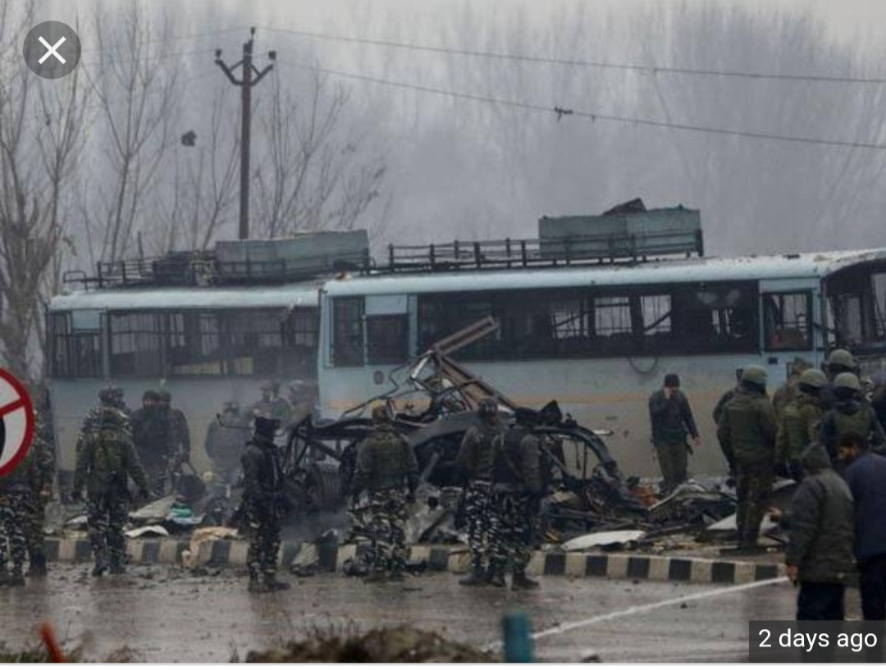
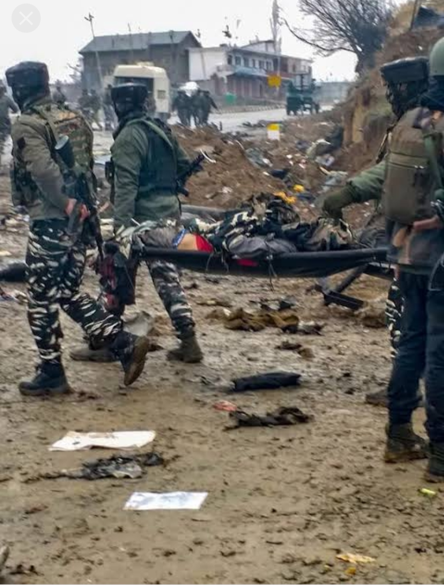
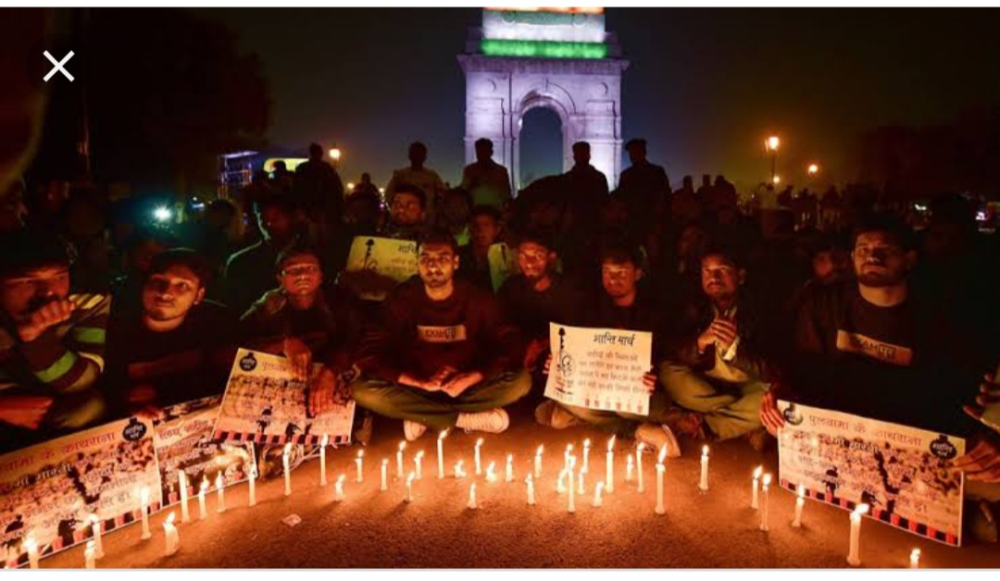
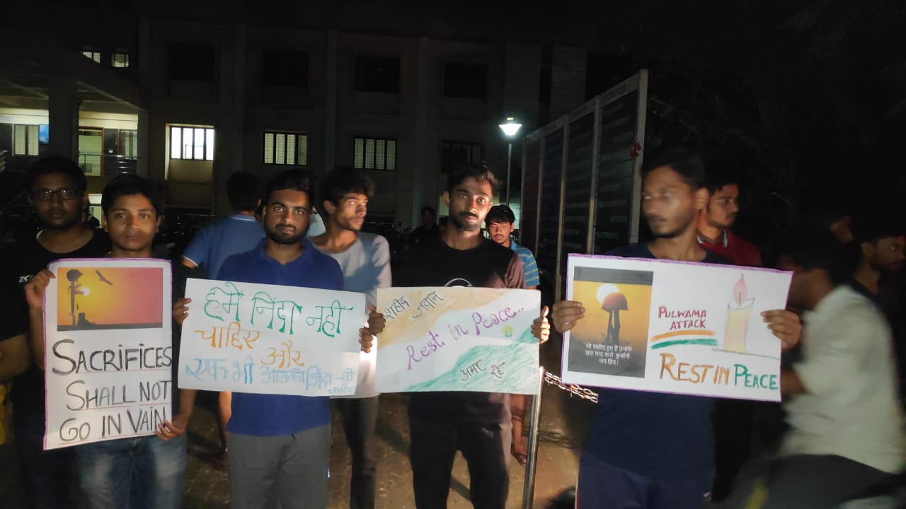

# raviraushankr.github.io
<!DOCTYPE html>
<html>
<head>
<title>Pulwama attack</title>
</head>
<body>

<mark>
PULWAMA</mark>-The Biggest terror attack in india

About<u> 44 soldiers</u> were killed and <b>mostly of the were CRPF.</b> This makes all people angry and  nation wanted only <q>bloood for blood.</q><i><b> many lost their sons,many their husband,many their fathers.</i> </b>

All people of nation were protesting in different ways. We students of <q>school of engineering,CUSAT</q> also shown  our anger to this coward attack in peaceful manner.

People protesting at india gate

 CUSAT students candle march

<h3>I listened a song on this attack,was awesome.Understand the song,this will touch your heart.<q>click on link below to listen it:</q></h3> 
<a href="https://www.youtube.com/watch?v=XQPrPzT6uqE&feature=youtu.be&has_verified=1" target="_blank" >Vande matram song on pulwama attack</a>

can't explain how much it made me think about the families of martyred soldiers. <b>sometimes this made me cry when i see the little hands performoing rituals to their fathers with wet eyes, croaning of ladies for their husband by beating their chests& aged people loosing their foundation in old age.</b>

<h1>providing below some of the links to see and analyse this attack:</h1>

<a href="https://www.thequint.com/news/india/pulwama-terror-attack-family-members-pay-last-respects-to-martyrs" target="_blank" >click here</a>
<a href="https://www.firstpost.com/india/pulwama-attack-kin-of-jawans-killed-in-blast-conduct-last-rites-3-year-old-lights-fathers-pyre-in-uttarakhand-6100381.html" target="_blank" >click here</a>
<a href="https://www.ndtv.com/india-news/pulwama-terror-attack-uttarakhand-mourns-death-of-army-major-vibhuti-dhoundiyal-killed-in-pulwama-te-1995843" target="_blank" >click here</a>
<a href="https://www.indiatvnews.com/news/india-pulwama-terror-attack-40-crpf-bravehearts-laid-to-rest-as-india-gives-final-farewell-tributes-pour-in-from-across-the-world-504777" target="_blank" >click here</a>
<h4>In my opinion the biggest way to help the martyred families is financial help.so,i donated a little amount of money to army relief funds.</h4>

you can also contribute by clicks on the links below:

<a href="https://paytm.com/helpinghand/crpf-wives-welfare-association" target="_blank" ><h3>Donate for pulwama martyred familes </h3></a>

some people takes the responsibilities for bringing up martyred sons and daughters like <u>gautam gambhir</u> and also a school principal  sell their bangles for help because when see saw the pics of attack, she can't control her sentiments and emotions .

<h3>But this time silent protest was not a solution.so,INDIA did <mark>AIR STRIKE</mark> by entering into pakistan and bombarded on terrorist camps.Nearly 200-300 terrorist were killed in this.</h3>

By doing this INDIA proved himself as:

<b>
<ol>
<li>Can't compromise with national security</li>
<li>Have ability to take revenge</li>
<li>Don't think india as before</li>
</b>
</ol>

But many parties are politicising this attack. This raises some important questions:
 
<ul>
<h4>
<li>Are parties are above than the nation for these peoples?</li>
<li>Is it right to take votes on the name of our army?</li>
<li>If you are taking responsibilty for <U>AIR STRIKE</U>,Then it is not your duty to take responsibilty for<u> martyred soldiers</u>?</li>
</h4>
</ul>

</body>
</html>
